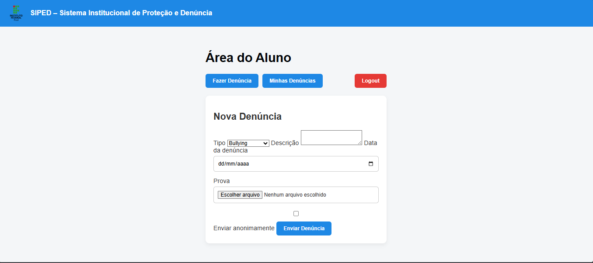
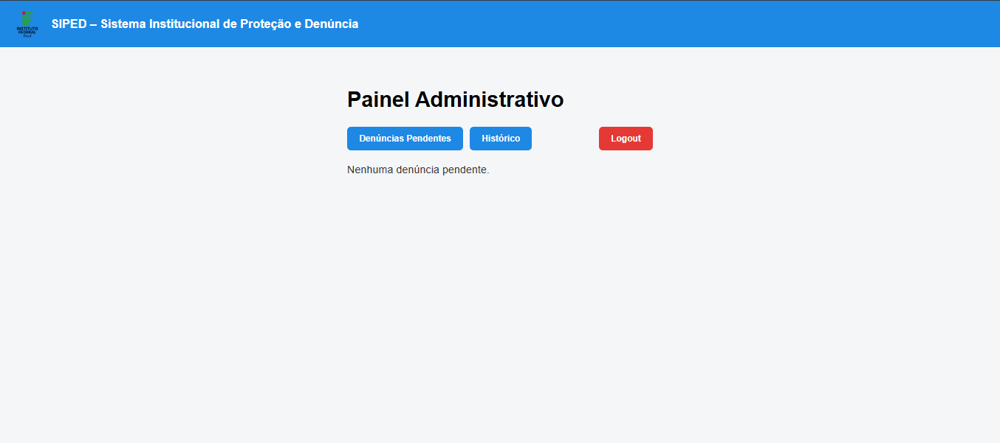

# siped
O SIPED é um sistema web de denúncias escolares desenvolvido com HTML, CSS e JavaScript, com o objetivo de permitir que alunos realizem denúncias para o Campus Pedro II de forma segura, organizada e opcionalmente anônima.
O sistema possui login com dois perfis (aluno e administrador). Alunos podem registrar denúncias, anexar imagens como prova e acompanhar o histórico. Administradores têm acesso a um painel para visualizar denúncias pendentes, analisar detalhes, visualizar imagens anexadas e atualizar o status das denúncias.

## 📸 Telas do Sistema

### Tela de Login

### Área do Aluno

### Painel Administrativo

